# LLM Lens
**Black-Box LLM Behavioral Intelligence Platform**

A scientific experimentation platform for studying how language models behave when treated as black boxes: run controlled
experiments, vary one thing at a time, evaluate answers with code where possible, put an interval on every number, flag
unusual behavior as a *question* (not a verdict), test it with follow-up experiments, and trace every metric back to the prompts
and responses behind it.

> **Read this first.** Everything in the screenshots and the demo dataset ran on a deterministic **mock model** that injects
> wrong answers on purpose, so the pipeline has something to analyse. It is labelled DEMO / MOCK DATA throughout the app and is
> **not evidence about any real language model.** The adapters for real models (Ollama, local Hugging Face, OpenAI-compatible)
> are written and tested against simulated back ends, but no real model has been run yet. See [docs/STATUS.md](docs/STATUS.md)
> for exactly what is verified and what is not.

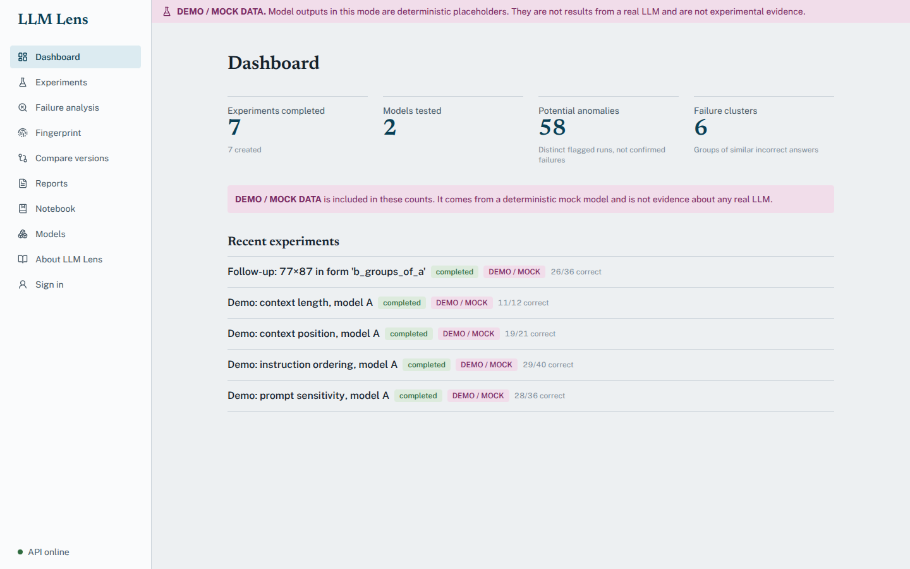

## Demo
- **Run it yourself in two minutes, no GPU, no keys, no server:**
  ```bash
  pip install -e backend
  llm-lens --local seed-demo        # six experiments (five types), a follow-up, clusters and a report, all labelled DEMO
  llm-lens --local run experiments/templates/arithmetic_representation.yaml --report report.md
  ```
- Public free-tier demo (mock model only; the first visit after idle can take about a minute to wake): https://llm-lens-vkmm.onrender.com
- Deploy your own: [docs/DEPLOYMENT.md](docs/DEPLOYMENT.md).

## Screenshots
| | |
|---|---|
| 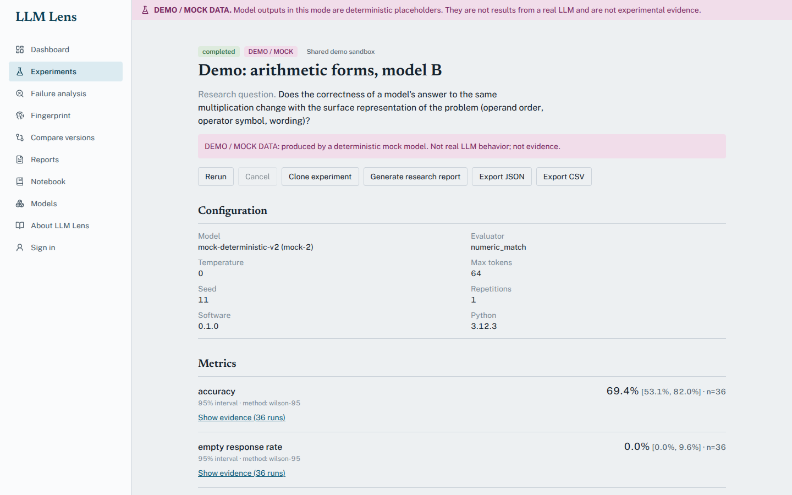 **Experiment**: configuration, metrics with 95% intervals, evidence on demand | 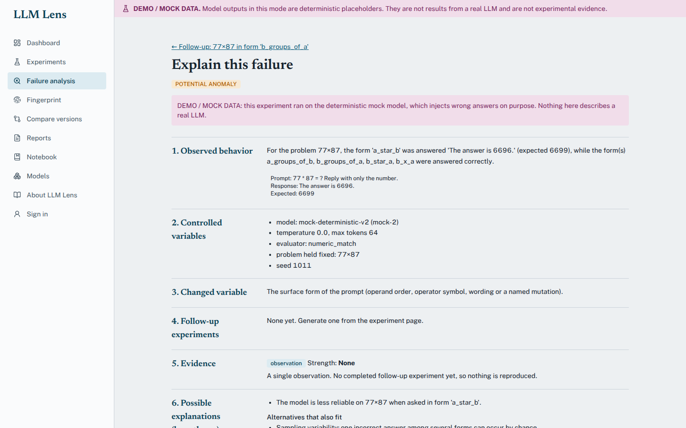 **Explain this failure**: observation, controls, change, follow-ups, evidence, alternatives, limits |
| 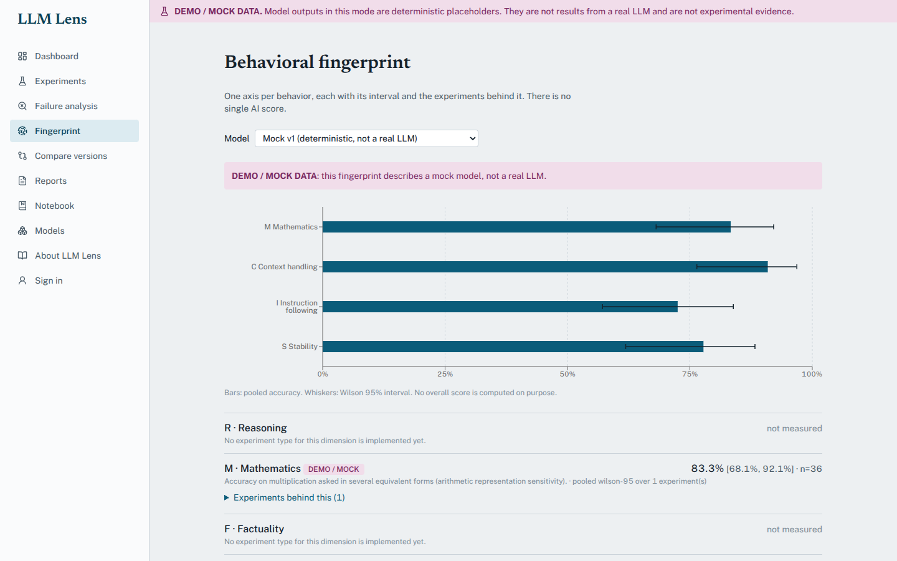 **Behavioral fingerprint**: 8 axes, unmeasured ones shown as unmeasured | 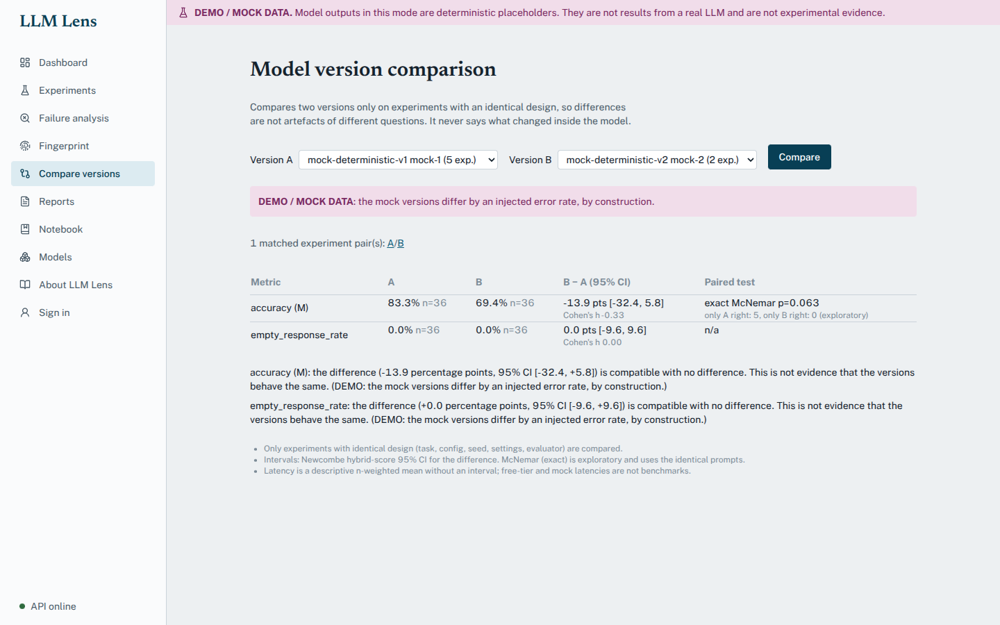 **Version comparison**: matched designs only, interval on the difference |
| 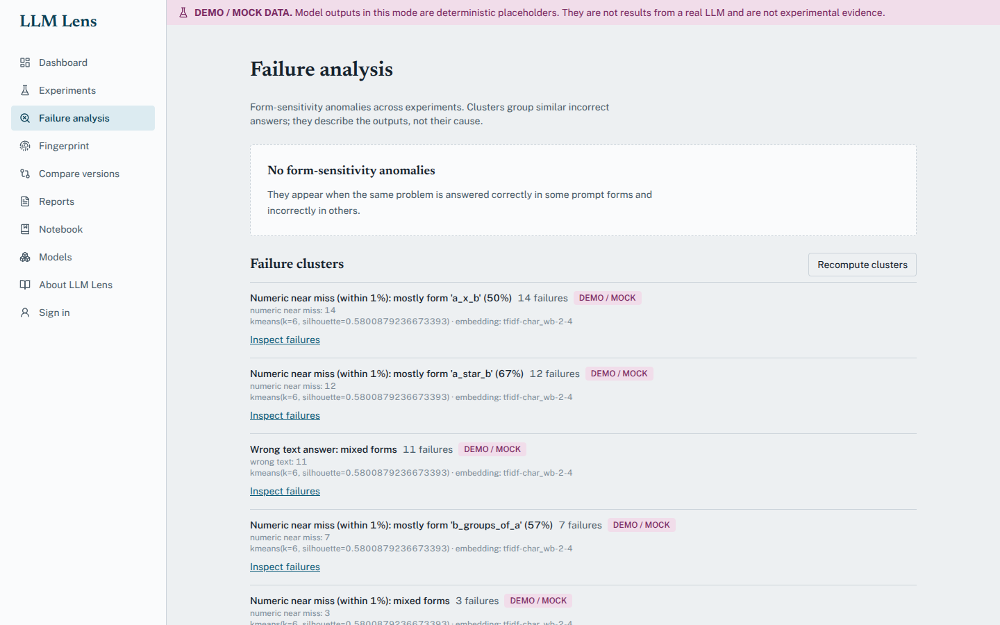 **Failure analysis**: clusters and anomalies | 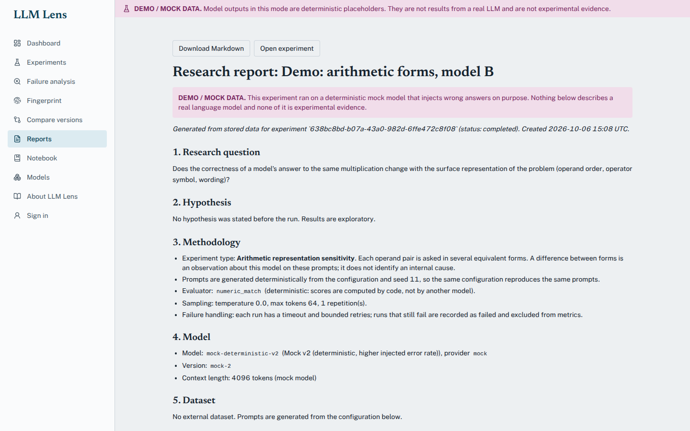 **Research report**: 14 fixed sections |
| 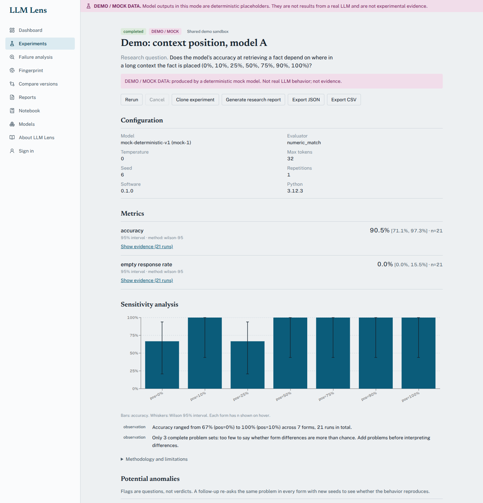 **Needle position vs accuracy**, in numeric order with intervals; it declines to interpret 3 trials | |

Phone (360 px): 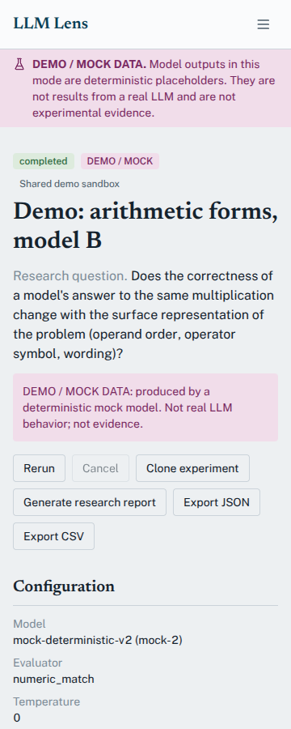 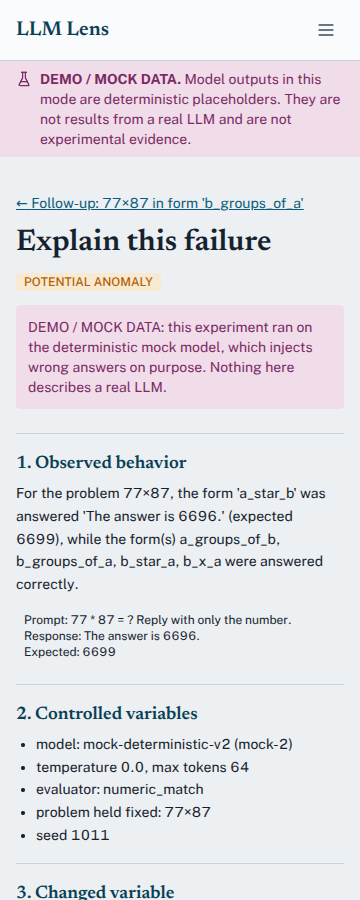

## Architecture
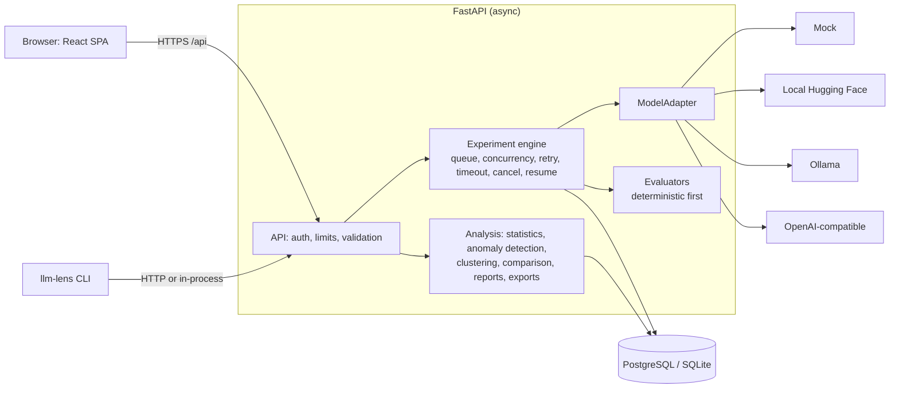
The engine only knows `ModelAdapter`, so providers are interchangeable. Details: [docs/ARCHITECTURE.md](docs/ARCHITECTURE.md).

## Features
- **Experiment engine**: bounded concurrency, per-run timeout and retry, cancellation, resume (only unfinished runs re-run), partial results, cloning, duplicate detection, full reproducibility record (seed, config, model version, software and hardware).
- **Experiment types** (six of the ten planned): arithmetic representation sensitivity, prompt sensitivity (deterministic mutations), instruction-ordering sensitivity (verifiable constraints), long-context retrieval by length, context-position sensitivity (needle among decoys), and version comparison.
- **Deterministic evaluators** (exact match, numeric match, constraint checking); LLM judges are modelled in the schema but not implemented, on purpose.
- **Statistics**: Wilson and bootstrap intervals, Newcombe interval for differences, Cohen's h and d, Cochran's Q, exact McNemar; every number ships with n, interval and method.
- **Evidence traceability**: any metric opens to its runs, prompts, responses and evaluator verdicts.
- **Anomaly detection**: form-sensitivity (same problem right in some forms, wrong in others), IQR, z-score, Isolation Forest. Flags say POTENTIAL ANOMALY.
- **Automated follow-ups**: a flagged anomaly generates a controlled test; a written rule decides *reproduced* or *not reproduced*, with strength.
- **Explain this failure** and **experiment lineage** (experiment → anomaly → follow-up).
- **Failure clustering** (TF-IDF by default, sentence embeddings optional), **behavioral fingerprint**, **matched-design version comparison**.
- **Research reports** (14 sections, generated by code, evidence-level tagged), **JSON/CSV export**, **private research notebook**.
- **Accounts** (scrypt + signed tokens), private/public experiments enforced on every endpoint, saved configurations, public-demo limits.
- **CLI**: `health`, `run`, `list`, `inspect`, `compare`, `report`, `export`, `login`, `seed-demo`.

## Research methodology
The platform separates **observation** (what was measured, with n and interval), **correlation** (a variable changed and the
metric moved, under control), **hypothesis** (a candidate explanation, never stated as fact) and **supported conclusion**.
Generated text never skips a level, never states a cause or an internal mechanism, refuses to interpret samples that are too
small, and says that a non-significant result is not evidence of no difference. Example of the difference:

- *Not allowed:* "The model fails because its attention breaks at 32k tokens."
- *Allowed:* "Accuracy dropped when the target sat between 70% and 90% of the context (n = 48, 95% CI …). This experiment does not establish the internal cause."

Anomalies are questions. The system re-asks the same problem across forms and seeds before calling anything reproduced, and even
a reproduced result is labelled a correlation. Methods: [docs/REPRODUCIBILITY.md](docs/REPRODUCIBILITY.md), [docs/EVALUATION.md](docs/EVALUATION.md), [docs/EXPERIMENTS.md](docs/EXPERIMENTS.md).

## Technology stack
React, TypeScript, Vite, Tailwind CSS, TanStack Query, React Router, Recharts, Lucide · Python, FastAPI, Pydantic, SQLAlchemy 2 (async), Alembic · PostgreSQL (SQLite for development and tests) · NumPy, SciPy, pandas, scikit-learn · PyTorch, Transformers and sentence-transformers (optional, local mode only) · Docker, nginx · pytest, Vitest, Puppeteer.

## Installation and local setup
Requirements: Python 3.11+, Node 20+ (for the web app), Git. Docker is optional.

**Command line only (no server):**
```bash
python -m venv .venv && source .venv/bin/activate        # Windows: .\.venv\Scripts\Activate.ps1
pip install -e backend
llm-lens --local health
llm-lens --local seed-demo
```
**Web app (two terminals):**
```bash
# 1) backend
cd backend && pip install -r requirements-dev.txt
DATABASE_URL=sqlite+aiosqlite:///./lens-dev.sqlite alembic upgrade head      # PowerShell: $env:DATABASE_URL="sqlite+aiosqlite:///./lens-dev.sqlite"
DATABASE_URL=sqlite+aiosqlite:///./lens-dev.sqlite uvicorn app.main:app --reload
# 2) frontend
cd frontend && npm install && npm run dev        # http://localhost:5173
```
Tests: `cd backend && pytest --cov=app` · `cd frontend && npm test` · `cd e2e && npm i && node e2e.mjs`. See [docs/TESTING.md](docs/TESTING.md).

## Docker setup
```bash
cp .env.example .env            # set POSTGRES_PASSWORD and SECRET_KEY (openssl rand -hex 32)
docker compose up --build       # frontend + backend + PostgreSQL, then open http://localhost
docker compose exec backend python -m app.cli --api http://localhost:8000 seed-demo
```
*Written but not yet run by the author: report any problems.*

## Public deployment (free tiers)
One container (UI + API) on Render's free plan and a Neon free PostgreSQL database, defined in `render.yaml`; the public build
runs the mock model only, with per-IP, per-account and concurrency limits. Free tiers change: follow
[docs/DEPLOYMENT.md](docs/DEPLOYMENT.md), which records the process and does not assume anything is permanently free.

## Environment variables
| Variable | Purpose | Default |
|---|---|---|
| `APP_ENV` | `development`, `production` (refuses weak secrets, enables HSTS) | `development` |
| `SECRET_KEY` | signs access tokens; ≥ 32 random characters in production | dev placeholder |
| `DATABASE_URL` | PostgreSQL (`postgresql://…` from Neon is converted automatically) or SQLite | SQLite file |
| `MODEL_PROVIDER` | `mock`, `local`, `ollama`, `openai_compatible` | `mock` |
| `MODEL_NAME`, `DEVICE` | model to run; `auto`, `cpu` or `cuda` | mock model, `auto` |
| `OLLAMA_BASE_URL`, `OPENAI_COMPAT_BASE_URL`, `OPENAI_COMPAT_API_KEY` | optional provider settings (the key is never needed by the core) | unset |
| `EMBEDDINGS_BACKEND` | `tfidf` or `sentence-transformers` (needs `requirements-ml.txt`) | `tfidf` |
| `PUBLIC_DEMO_MODE` | enable public-demo limits | `false` |
| `ALLOW_REGISTRATION`, `ALLOW_ANONYMOUS_WRITES` | account policy | `true` |
| `CORS_ORIGINS` | comma-separated origins (no `*` in production) | localhost |

More limits (rate, quotas, concurrency, request size) are listed in `.env.example`.

## Experiment examples
```bash
llm-lens --local run experiments/templates/arithmetic_representation.yaml --report report.md
llm-lens --local run experiments/templates/version_comparison_a.yaml
llm-lens --local run experiments/templates/version_comparison_b.yaml
llm-lens --local compare mock-deterministic-v1 mock-deterministic-v2
```
Template format and the ten planned experiments (three implemented): [docs/EXPERIMENTS.md](docs/EXPERIMENTS.md).

## Running a real model
```bash
ollama pull qwen2.5:0.5b                  # small, CPU-friendly
MODEL_PROVIDER=ollama MODEL_NAME=qwen2.5:0.5b llm-lens --local run experiments/templates/arithmetic_representation.yaml
```
(Remove the `model:` line from the template, or it will request the mock model.) Local Hugging Face: `pip install -r backend/requirements-ml.txt`, then `MODEL_PROVIDER=local MODEL_NAME=<hf id>`. No model is downloaded automatically at start-up.

## Adding models, evaluators and experiments
See [docs/CONTRIBUTING.md](docs/CONTRIBUTING.md): a model is a `ModelAdapter` subclass registered in `adapters/factory.py`; an
evaluator is a small class registered in `evaluators/registry.py`; an experiment type builds deterministic prompt items and is
registered in `experiments/registry.py`. Each comes with tests.

## Reproducibility
Every experiment stores its prompts (deterministic from configuration and seed), model and version, parameters, evaluator and
version, software and library versions, hardware, and timestamps. **Clone** makes an identical experiment; **Resume** re-runs only
unfinished runs. Reports include a reproducibility table and the command to rerun.

## Limitations
- No real language model has been run; all shown results are mock data. Real results may differ in every way that matters.
- Four of eight fingerprint dimensions can be measured (M, S, I, C); four of ten planned experiments are not built (consistency, false premise, multilingual, tool use).
- No LLM-judge evaluation; deterministic evaluators only (the last-number rule can mis-score unusual formats).
- Black-box experiments cannot identify internal mechanisms, and this tool says so.
- PostgreSQL, Docker and the CI workflow are written but unverified in the development environment.
- Free-tier hosting changes; the in-process rate limiter suits a single container.

## Roadmap
Consistency, false-premise, multilingual and tool-use experiments; a first real-model run and report; LLM-judge evaluation with a deterministic cross-check; PDF export; email
verification and password reset; Redis rate limiting; PostgreSQL benchmarks.

## Why this project is difficult
It combines **LLM engineering** (provider-independent adapters, deterministic generation, token accounting), **experiment
design** (controlled mutations, matched designs, follow-ups that can disprove a hypothesis), **statistics** (interval
estimators chosen for small samples, paired tests, effect sizes, refusing to over-interpret), **machine learning** (outlier
detection, text embeddings, silhouette-selected clustering that admits when there is no structure), **distributed-systems
concerns** (bounded concurrency, cancellation, retry and resume, idempotent analysis, race-free writes, multi-tenant access
control) and **evaluation** (code-checkable scoring first, evidence traceability, labelling anything model-judged). The hard
part is not any single piece; it is keeping every claim honest end to end.

## Documentation
[Architecture](docs/ARCHITECTURE.md) · [Experiments](docs/EXPERIMENTS.md) · [Evaluation](docs/EVALUATION.md) · [Reproducibility](docs/REPRODUCIBILITY.md) · [Security](docs/SECURITY.md) · [Testing](docs/TESTING.md) · [Performance](docs/PERFORMANCE.md) · [Deployment](docs/DEPLOYMENT.md) · [Status](docs/STATUS.md) · [Contributing](docs/CONTRIBUTING.md) · [Resume text](docs/RESUME.md)

## License
MIT
